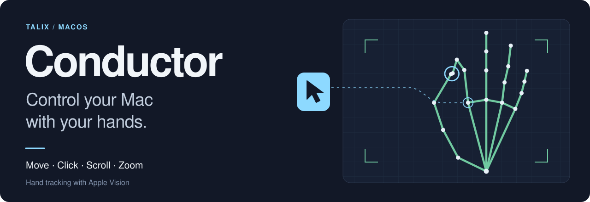

<p align="center">
  
</p>

<p align="center">
  <a href="https://github.com/dev-talix/conductor/releases/latest/download/Conductor.zip"><strong>Download for macOS</strong></a> ·
  <a href="https://conductor.talix.app">Website</a> ·
  <a href="docs/user-guide.md">User guide</a> ·
  <a href="docs/development.md">Developer docs</a>
</p>

<p align="center">
  macOS 14 or later · Apple silicon and Intel<br>
  <a href="https://github.com/dev-talix/conductor/actions/workflows/ci.yml"></a>
</p>

Conductor is a macOS menu bar app that turns webcam hand gestures into mouse and keyboard input.
Move the cursor, pinch to click or drag, hold your hand to scroll, and use both hands to zoom.
Apple's Vision framework tracks your hands on your Mac. Camera images and video are never saved or sent.

## Get started

1. [Download Conductor.zip](https://github.com/dev-talix/conductor/releases/latest/download/Conductor.zip), unzip it, and move **Conductor.app** to **Applications**.
2. Open the app. Allow **Camera** access, then enable Conductor in **System Settings > Privacy & Security > Accessibility** so it can move the cursor and click.
3. Follow the setup assistant to choose your camera and displays, calibrate your reach, and try the gestures. Reach calibration is optional; you can use the automatic control box.
4. Hold an open hand still for about half a second to take control. Move your whole hand to aim, then pinch your thumb and index finger to click.

Conductor lives in the menu bar. **Show Preview** displays the hand landmarks and control box.
Press **Control + Option + Command + H** to turn tracking on or off from any app.

> Numerical gesture logs are shared with the developer by default in the released app.
> Turn off **Settings > Data > Send logs to the developer** to stop uploads.
> Recording continues locally. [What the logs contain](#data-and-privacy).

## The gestures

| Your hand | What happens |
| --- | --- |
| Open hand, held still | Take control |
| Move your hand | Move the cursor |
| Pinch thumb + index, then release | Click |
| Hold that pinch and move | Drag; release to drop |
| Two quick index pinches | Double click |
| Pinch thumb + middle finger | Right click |
| Two fingers up or a closed fist, held above or below the starting height | Scroll |
| Both hands pinched, spread or squeeze | Zoom |
| Two fingers up, flick right or left | Back or forward |
| Point with your index finger and thumb out, held briefly | Switch display |

For scrolling, hold your hand above its starting height to scroll down the page, or below it to scroll up.
Farther from that height scrolls faster. Open your hand to stop.
The cursor follows your index knuckle, so move your whole hand rather than just your fingertips.

[Gesture details](docs/user-guide.md#gestures) cover timing, scroll mode, and how to avoid accidental inputs.

## Make it fit your setup

- **Your own bindings.** Assign gestures to clicks, shortcuts, held keys, scroll, zoom, pause, or display switching in Settings > Gestures. Give individual apps their own profiles.
- **Dwell click and presets.** Click by holding the cursor still, choose either hand, and adjust movement with the Standard, Steadier, or Bigger movements presets.
- **Several displays.** Map your hand to all screens, the main display, the display under the cursor, or the one your head is turned toward. Pointing can switch displays by hand.
- **Push-to-talk.** Bind a gesture to hold a key. The Gestures tab has a setup option for Flo's Right Command shortcut.
- **Visible feedback.** The cursor ring shows gesture progress. Optional sounds and VoiceOver announcements mark control changes.

See [control and accessibility](docs/user-guide.md#control-and-accessibility),
[multiple displays](docs/user-guide.md#multiple-displays), and [tuning](docs/user-guide.md#tuning).

## Data and privacy

Every tracking session writes a numerical log in `~/Library/Logs/Conductor/`.
Logs contain hand landmarks, head angles and eye positions, cursor actions, frame timings,
and settings and device details such as Mac and camera models and display layout.
They contain no camera images, video, typed text, or app names.

The released app sends finished logs and gesture-check reports to the developer by default,
filed under a random install ID. Turn off **Settings > Data > Send logs to the developer** to stop uploads.
This keeps logs local; it does not stop recording or remove files already accepted by the server.
Local logs are kept for a week or 1 GB, whichever comes first. **Show Logs** opens the folder.
Source builds without an upload server keep their logs local.

Read the [recording format](docs/development.md#gesture-log) and [upload behavior](docs/development.md#uploading-gesture-logs).

## Build from source

Use a Swift toolchain with the macOS SDK. Build the app bundle so macOS can request camera access.

```sh
git clone https://github.com/dev-talix/conductor.git
cd conductor
APP_OUTPUT="$PWD/Conductor.app" ./build-app.sh
open Conductor.app
```

This builds a signed app bundle in the checkout. The script uses a local signing identity when available
and falls back to ad-hoc signing. See [permissions after rebuilding](docs/development.md#permissions-after-rebuilding)
if Accessibility access stops working after a rebuild.

For a development check:

```sh
swift build --force-resolved-versions
swift test --force-resolved-versions
```

## Go deeper

| Guide | What's inside |
| --- | --- |
| [User guide](docs/user-guide.md) | Setup, gestures, display calibration, camera choices, and tuning |
| [Development and recordings](docs/development.md) | Builds, releases, tests, log replay, the upload server, and DuckDB queries |
| [Domain glossary](CONTEXT.md) | The terms used by the app, code, and documentation |

Found a problem? [Open an issue](https://github.com/dev-talix/conductor/issues/new) with your macOS version,
camera model, and what you expected the gesture to do. If you've shared logs, include the install ID from Settings > Data.
